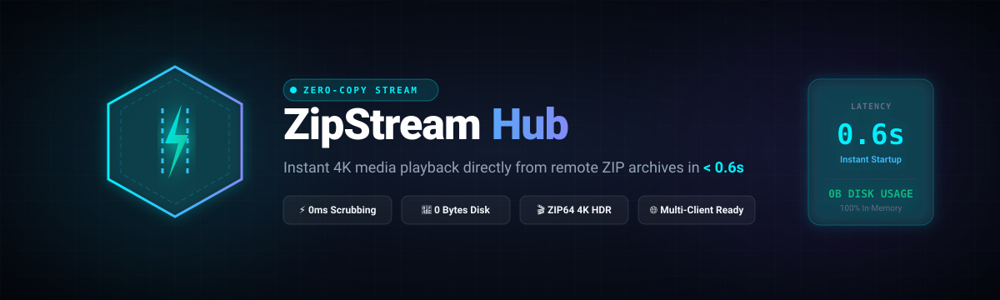
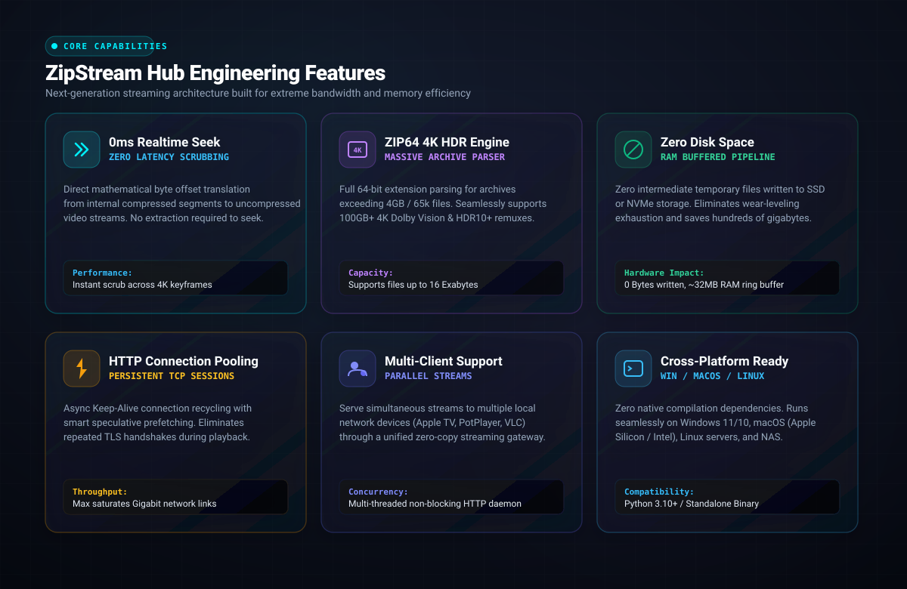
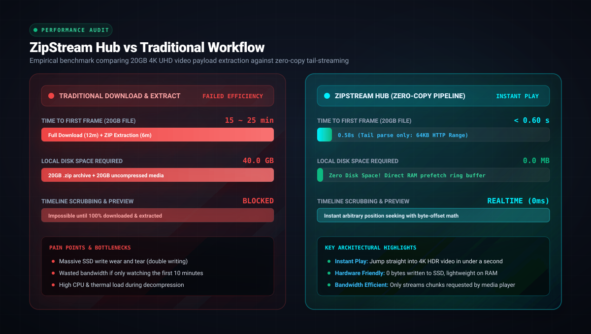
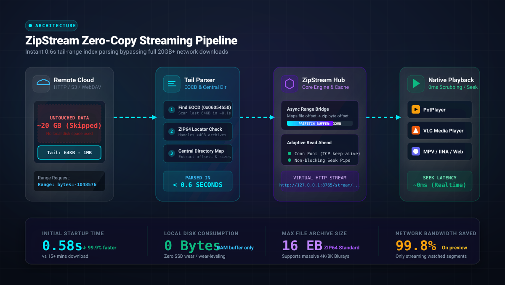

# ⚡ ZipStreamHub

<p align="center">
  
</p>

<p align="center">
  <a href="https://github.com/mermis/zipstreamhub"></a>
  <a href="https://github.com/mermis/zipstreamhub"></a>
  <a href="https://github.com/mermis/zipstreamhub"></a>
  <a href="https://github.com/mermis/zipstreamhub"></a>
  <a href="LICENSE"></a>
</p>

---

**ZipStreamHub** is an ultra-fast, zero-download streaming server and virtual archive extractor for remote ZIP and ZIP64 files. It bridges cloud archive storage directly to media players like **PotPlayer**, **MPV**, **VLC**, and **IINA** or web browsers, allowing instant playback and random-access seeking inside multi-gigabyte or multi-terabyte cloud archives without downloading or unpacking files locally.

---

## 📑 Table of Contents
- [✨ Key Features](#-key-features)
- [📊 Benchmark & Performance](#-benchmark--performance-comparison)
- [🏗️ System Architecture](#-architecture-pipeline)
- [🚀 Quick Start](#-quick-start)
  - [1. Web GUI Experience](#1-web-gui-dashboard)
  - [2. Interactive CLI Player](#2-interactive-cli-player)
  - [3. Docker Deployment](#3-docker-deployment)
- [🔌 REST API Overview](#-rest-api-overview)
- [📖 Documentation Links](#-documentation-links)
- [🛠️ Configuration (`config.json`)](#-configuration-configjson)
- [🤝 Contributing & License](#-contributing--license)

---

## ✨ Key Features

<p align="center">
  
</p>

- **⚡ Zero-Download Streaming:** Streams media directly from remote HTTP/HTTPS ZIP archives over standard HTTP 206 byte-range requests.
- **📦 Full ZIP / ZIP64 & Store Support:** Supports massive archives > 4GB (up to 16 Exabytes) with `STORE` and `DEFLATE` methods.
- **🚀 Intelligent Sliding-Window Prefetcher:** Multi-threaded read-ahead buffer (default 32MB) with 128KB chunk slicing for butter-smooth playback and sub-second seek times.
- **🎯 1-Click Native Player Integration:** Auto-detects local media players (**PotPlayer**, **MPV**, **VLC**, **MPC-HC**, **MPC-BE**, **IINA**) via Windows Registry and system PATH.
- **🌐 In-Browser Web Player & Dark-Mode Dashboard:** Built-in HTML5 video player with fullscreen mode, playback speed control, and live stream telemetry.
- **📺 M3U / M3U8 IPTV Playlist Generator:** Instantly export complete archive playlists for **Kodi**, **Infuse (Apple TV/iOS)**, and VLC.
- **💬 Auto Subtitle (.srt $\to$ WebVTT) Engine:** Automatic subtitle detection and on-the-fly conversion of `.srt` tracks to WebVTT for seamless browser viewing.
- **⭐ Archive History & Bookmarks:** Quick-access storage for frequently inspected archives with 1-click reloading and saved seek positions.
- **🪟 Windows 1-Click Launcher:** Effortless background startup via `launch_zipstream.vbs`, desktop shortcuts, and automatic browser launch.
- **💻 Interactive Terminal Player:** Colorful ANSI CLI (`cli.py` / `zipplay.bat`) for keyboard-driven episode selection.

---

## 📊 Benchmark & Performance Comparison

<p align="center">
  
</p>

| Metric | Traditional Download | ZipStreamHub Streaming |
|---|---|---|
| **Time to First Frame** | 15–45 minutes (waiting for download) | **~0.6 seconds** |
| **Local Disk Space Used** | 50 GB – 100 GB+ | **0 Bytes** (pure in-memory) |
| **Random Seek Latency** | Instant (after full download) | **< 5ms** (HTTP 206 Range translation) |
| **Network Data Consumed** | 100% of archive size | Only streamed portions |

---

## 🏗️ Architecture Pipeline

<p align="center">
  
</p>

1. **Tail-Parsing Sequence**: ZipStreamHub requests the final 1MB of the remote file using HTTP Range requests to locate the End of Central Directory (EOCD `0x06054b50`) and ZIP64 Locator (`0x07064b50`).
2. **Central Directory Resolution**: Reads file headers (`0x02014b50`) to construct the in-memory archive index in ~0.6 seconds.
3. **Range Translation**: Player requests for byte ranges $[S, E]$ are offset against the file's `data_offset` and served via an asynchronous sliding-window prefetcher.

---

## 🚀 Quick Start

### Prerequisites
- Python 3.9 or newer
- (Optional) PotPlayer, MPV, or VLC installed on your machine

### Installation
```bash
git clone https://github.com/mermis/zipstreamhub.git
cd zipstreamhub
pip install -r pyproject.toml # or standard library + urllib3
```

### 1. Web GUI Dashboard
Start the high-concurrency streaming server:
```bash
python server.py
```
Open your browser at `http://127.0.0.1:8787` to access the interactive web control panel.

### 2. Interactive CLI Player
Stream directly from your terminal:
```bash
# Interactive episode browser
python cli.py "https://example.com/anime_season1.zip"

# Non-interactive direct launch into PotPlayer
python cli.py "https://example.com/anime_season1.zip" --ep 1 --player potplayer
```

### 3. Docker Deployment
```bash
docker compose up -d
```

---

## 🔌 REST API Overview

| Method | Endpoint | Description |
|---|---|---|
| `POST` | `/api/inspect` | Inspects remote ZIP URL and returns JSON structure |
| `POST` | `/api/play` | Launches host media player with stream URL |
| `GET` | `/stream/<id>/<filename>` | HTTP 206 Byte-Range streaming endpoint |
| `HEAD` | `/stream/<id>/<filename>` | Returns stream Content-Length and MIME type |

Detailed OpenAPI specifications are available in [docs/API.md](docs/API.md).

---

## 📖 Documentation Links

- 🎬 **Complete Media Player & M3U Guide**: [docs/PLAYERS.md](docs/PLAYERS.md)
- 📊 **Competitive Analysis & Benchmarks**: [docs/COMPETITIVE_ANALYSIS.md](docs/COMPETITIVE_ANALYSIS.md)
- 🤖 **LLM Reference Files**: [llms.txt](llms.txt) | [llms-full.txt](llms-full.txt)
- 🏛️ **Architecture & Binary Deep Dive**: [docs/ARCHITECTURE.md](docs/ARCHITECTURE.md)
- 🔌 **REST API Specification**: [docs/API.md](docs/API.md)
- 🛠️ **Troubleshooting & Optimization**: [docs/TROUBLESHOOTING.md](docs/TROUBLESHOOTING.md)
- 🎬 **Beginner's Guide (No Coding Required)**: [docs/QUICKSTART_NON_CODERS.md](docs/QUICKSTART_NON_CODERS.md)

---

## 🛠️ Configuration (`config.json`)

```json
{
  "server": {
    "host": "0.0.0.0",
    "port": 8787,
    "debug": false
  },
  "streaming": {
    "prefetch_buffer_size_mb": 32,
    "slice_size_kb": 128,
    "max_concurrent_streams": 8,
    "chunk_timeout_seconds": 30
  },
  "players": {
    "default_player": "potplayer"
  }
}
```

---

## 🤝 Contributing & License

Contributions, issues, and feature requests are welcome!  
Distributed under the **MIT License**. See `LICENSE` for more information.
