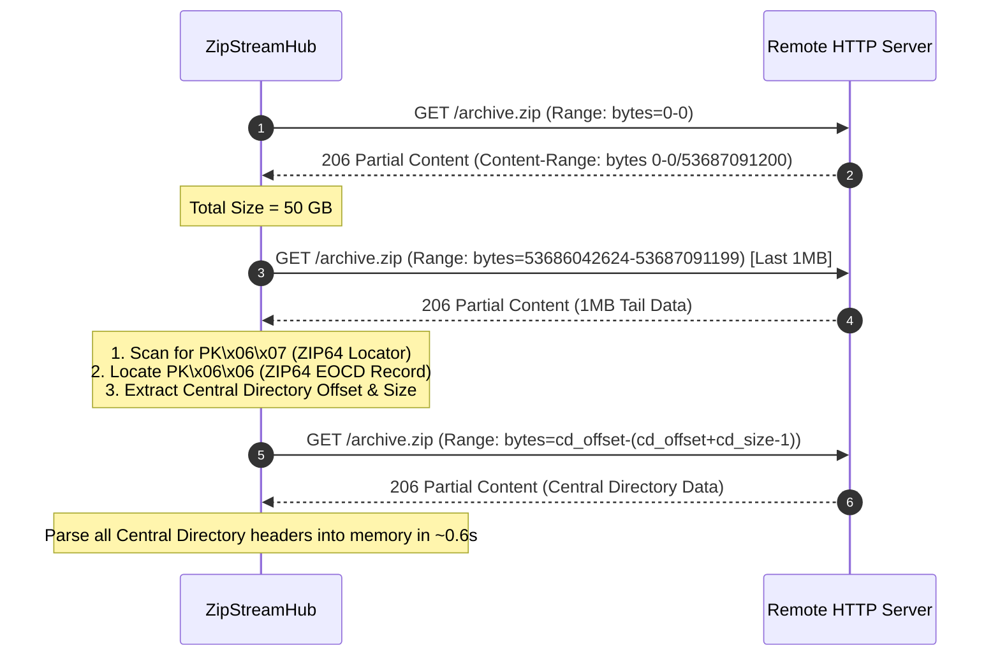

# 🏛️ ZipStreamHub Architecture & Binary Deep Dive

This document details the internal binary parsing mechanics, network range translations, and memory concurrency design powering ZipStreamHub.

---

## 1. ZIP & ZIP64 Binary Structure

ZIP files are inherently structured for random access: the file index (**Central Directory**) is stored at the **end of the archive**, rather than the beginning.

```
┌────────────────────────────────────────────────────────┐
│                   ZIP File Layout                      │
├────────────────────────────────────────────────────────┤
│  [Local File Header 1] + [File Data 1]                 │
│  [Local File Header 2] + [File Data 2]                 │
│  ...                                                   │
│  [Local File Header N] + [File Data N]                 │
│  ────────────────────────────────────────────────────  │
│  [Central Directory File Header 1] (0x02014b50)        │
│  [Central Directory File Header 2] (0x02014b50)        │
│  ...                                                   │
│  [Central Directory File Header N] (0x02014b50)        │
│  ────────────────────────────────────────────────────  │
│  [ZIP64 End of Central Directory] (0x06064b50) *opt   │
│  [ZIP64 EOCD Locator] (0x07064b50) *opt               │
│  [End of Central Directory Record] (0x06054b50)        │
└────────────────────────────────────────────────────────┘
```

### Key Signatures (Little-Endian Hex)

| Signature | Name | Little-Endian Hex | Size |
|---|---|---|---|
| `PK\x03\x04` | Local File Header | `0x04034b50` | 30 bytes + name + extra |
| `PK\x01\x02` | Central Directory Header | `0x02014b50` | 46 bytes + name + extra + comment |
| `PK\x05\x06` | End of Central Directory (EOCD) | `0x06054b50` | 22 bytes + comment |
| `PK\x06\x07` | ZIP64 EOCD Locator | `0x07064b50` | 20 bytes |
| `PK\x06\x06` | ZIP64 EOCD Record | `0x06064b50` | 56 bytes + extra |

---

## 2. Remote ZIP Tail-Parsing Algorithm

Instead of streaming the whole archive, `RemoteZipReader` follows this zero-waste sequence:



### Parsing ZIP64 64-Bit Overflows
When an archive exceeds 4GB (32-bit limit `0xFFFFFFFF`):
- `uncomp_size`, `comp_size`, or `local_header_offset` are set to `0xFFFFFFFF` in the Central Directory header.
- The real 64-bit integer (`unsigned long long`, `<Q`) is retrieved from Extra Field ID `0x0001` (ZIP64 Extra Field tag).

---

## 3. Dynamic Local Data Offset Calculation

The Central Directory gives the offset to the **Local File Header**, not the actual uncompressed payload. Each local header has variable filename and extra field lengths.

`RemoteZipReader.get_data_offset(entry)` fetches the exact 30 bytes of the local header:

$$\text{data\_offset} = \text{local\_header\_offset} + 30 + \text{name\_len} + \text{extra\_len}$$

This value is cached thread-safely in `entry["data_offset"]` to prevent redundant network lookups.

---

## 4. HTTP 206 Byte-Range Translation Formula

When the player seeks to second $T$, the demuxer requests byte range $[S_{\text{client}}, E_{\text{client}}]$.

The translated remote range $[S_{\text{remote}}, E_{\text{remote}}]$ is:

$$S_{\text{remote}} = \text{data\_offset} + S_{\text{client}}$$
$$E_{\text{remote}} = \text{data\_offset} + E_{\text{client}}$$

Because the file was archived using `STORE` (Method 0, no compression), byte $X$ in the virtual stream corresponds **1:1** to byte $\text{data\_offset} + X$ in the remote file.

---

## 5. Dynamic High-Throughput Buffer Engine (`StreamPrefetcher`)

To eliminate player stutter during high-bitrate 4K REMUX streaming and saturate high-bandwidth gigabit connections, `StreamPrefetcher` runs an asynchronous, dynamically configurable sliding-window pipeline:

```
                  ┌─────────────────────────────────────────┐
                  │          StreamPrefetcher               │
                  └────────────────────┬────────────────────┘
                                       │
                ┌──────────────────────┴──────────────────────┐
                ▼                                             ▼
   [Worker Thread (_fetch_worker)]               [Player Consumer (stream_chunks)]
   - Urllib3 Keep-Alive HTTP Pool                - Reads from Queue (timeout 15s)
   - Fetches 2MB Blocks (BLOCK_SIZE)             - Slices into Configurable KB Units
   - Range: bytes=curr-(curr+2MB-1)                (ZIPSTREAM_SLICE_KB, default 128KB)
   - Pushes into N-slot Queue (Up to 5GB RAM)    - Delivers Instant Seek & Low Latency
                │                                             │
                └──────────────► [Thread-Safe Queue] ◄────────┘
                                 (Max N x 2MB Blocks)
```

### Dynamic Buffer Sizing & RAM Presets
The buffer engine is fully tunable via `ZIPSTREAM_PREFETCH_MB` or `config.json`:
- **4GB RAM Systems (`64MB`)**: Conservative sliding window (~30–60s buffer) for low-overhead 1080p playback.
- **8GB–16GB RAM Systems (`1024MB / 1GB`)**: Balanced buffer for high-bitrate 4K HDR streams with instant scrub response.
- **32GB+ High-End / Gigabit Fiber (`5120MB / 5GB`)**: Maximum-throughput buffer pipeline capable of holding multi-gigabyte stream chunks in RAM for ultra-fast chapter skipping without internet bottlenecks.

### Backpressure & Seek Interruption Mechanics
- **Dynamic Backpressure**: When the player buffer is saturated, `queue.put(block)` blocks upstream fetch loops until the consumer frees space, strictly guarding against memory leaks.
- **Immediate Abort & Memory Drain**: When a player seeks to a new timestamp, the client TCP socket closes. The HTTP handler calls `prefetcher.close()`, which sets `abort_event`, terminates the upstream worker thread, drains all queued memory blocks, and releases allocations back to the OS in $< 5\text{ms}$.
- **Socket Slicing**: Fetched upstream blocks are sliced into fine-grained units (`SOCKET_SLICE_SIZE`, default 128KB) before writing to the client socket, ensuring minimal chunk-transit latency.
